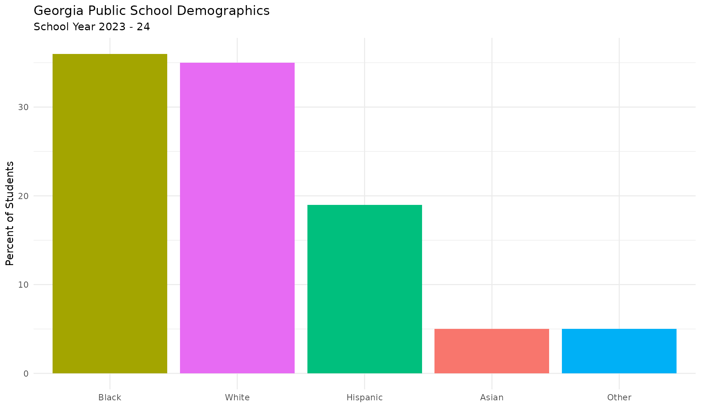
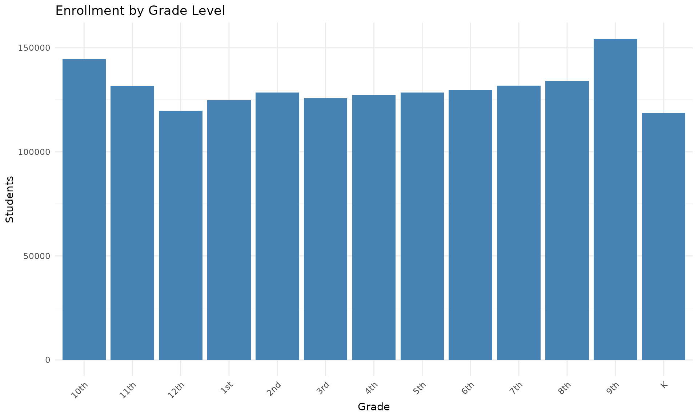

# Georgia Enrollment Data

## Getting Started

``` r
library(gaschooldata)
library(ggplot2)
library(dplyr)
library(scales)
```

## Data Availability

Check which years are available:

``` r
years <- get_available_years()
print(years)
#> $min_year
#> [1] 2011
#> 
#> $max_year
#> [1] 2024
#> 
#> $description
#> [1] "GOSA enrollment data (2010-11 through 2023-24 school years)"
```

## Fetching Enrollment Data

Fetch enrollment data for the most recent year:

``` r
enr <- fetch_enr(years$max_year)

# Data structure
cat("Rows:", nrow(enr), "\n")
#> Rows: 2523
cat("Columns:", ncol(enr), "\n\n")
#> Columns: 52

# Detail levels (State, District, School)
cat("Detail levels:\n")
#> Detail levels:
print(table(enr$DETAIL_LVL_DESC))
#> 
#> District   School    State 
#>      218     2304        1
```

## Data Structure

The data includes demographic breakdowns for state, district, and school
levels:

``` r
# Key columns
key_cols <- c("DETAIL_LVL_DESC", "SCHOOL_DSTRCT_NM", "INSTN_NAME",
              "ENROLL_PCT_WHITE", "ENROLL_PCT_BLACK", "ENROLL_PCT_HISPANIC",
              "ENROLL_PCT_ASIAN", "ENROLL_PCT_MALE", "ENROLL_PCT_FEMALE")

# View state-level data
state_data <- enr %>%
  filter(DETAIL_LVL_DESC == "State") %>%
  select(all_of(key_cols[key_cols %in% names(enr)]))

knitr::kable(state_data, caption = "State-Level Demographics")
```

| DETAIL_LVL_DESC | SCHOOL_DSTRCT_NM  | INSTN_NAME        | ENROLL_PCT_WHITE | ENROLL_PCT_BLACK | ENROLL_PCT_HISPANIC | ENROLL_PCT_ASIAN | ENROLL_PCT_MALE | ENROLL_PCT_FEMALE |
|:----------------|:------------------|:------------------|:-----------------|:-----------------|:--------------------|:-----------------|:----------------|:------------------|
| State           | All Column Values | All Column Values | 35               | 36               | 19                  | 5                | 51              | 49                |

State-Level Demographics

## Visualizing Demographics

``` r
# Get state demographics
state <- enr %>%
  filter(DETAIL_LVL_DESC == "State")

# Extract percentages
demographics <- data.frame(
  group = c("White", "Black", "Hispanic", "Asian", "Other"),
  pct = as.numeric(c(
    state$ENROLL_PCT_WHITE,
    state$ENROLL_PCT_BLACK,
    state$ENROLL_PCT_HISPANIC,
    state$ENROLL_PCT_ASIAN,
    100 - sum(as.numeric(c(
      state$ENROLL_PCT_WHITE,
      state$ENROLL_PCT_BLACK,
      state$ENROLL_PCT_HISPANIC,
      state$ENROLL_PCT_ASIAN
    )), na.rm = TRUE)
  ))
)

ggplot(demographics, aes(x = reorder(group, -pct), y = pct, fill = group)) +
  geom_col() +
  labs(title = "Georgia Public School Demographics",
       subtitle = paste("School Year", years$max_year - 1, "-", substr(years$max_year, 3, 4)),
       x = "", y = "Percent of Students") +
  theme_minimal() +
  theme(legend.position = "none")
```



## Largest Districts

``` r
# Note: The raw data doesn't have total enrollment as a single column
# For now, we'll just show district names

districts <- enr %>%
  filter(DETAIL_LVL_DESC == "District") %>%
  head(10) %>%
  select(SCHOOL_DSTRCT_NM, ENROLL_PCT_WHITE, ENROLL_PCT_BLACK, ENROLL_PCT_HISPANIC)

knitr::kable(districts, caption = "Sample District Demographics")
```

| SCHOOL_DSTRCT_NM | ENROLL_PCT_WHITE | ENROLL_PCT_BLACK | ENROLL_PCT_HISPANIC |
|:-----------------|:-----------------|:-----------------|:--------------------|
| Appling County   | 54               | 21               | 20                  |
| Atkinson County  | 40               | 14               | 44                  |
| Bacon County     | 57               | 22               | 16                  |
| Baker County     | 25               | 56               | 11                  |
| Baldwin County   | 23               | 65               | 5                   |
| Banks County     | 79               | 2                | 13                  |
| Barrow County    | 47               | 15               | 27                  |
| Bartow County    | 65               | 10               | 18                  |
| Ben Hill County  | 41               | 43               | 12                  |
| Berrien County   | 71               | 12               | 10                  |

Sample District Demographics

## Grade-Level Enrollment

If grade data is available, it will appear as columns like `GRADE_K`,
`GRADE_1st`, etc.:

``` r
grade_cols <- grep("^GRADE_", names(enr), value = TRUE)

if (length(grade_cols) > 0) {
  cat("Grade-level enrollment columns available:\n")
  print(grade_cols)

  # State-level grade enrollment
  state <- enr %>% filter(DETAIL_LVL_DESC == "State")
  grades <- data.frame(
    grade = grade_cols,
    count = sapply(grade_cols, function(g) as.numeric(state[[g]]))
  )
  grades$grade <- gsub("GRADE_", "", grades$grade)

  ggplot(grades, aes(x = grade, y = count)) +
    geom_col(fill = "steelblue") +
    labs(title = "Enrollment by Grade Level",
         x = "Grade", y = "Students") +
    theme_minimal() +
    theme(axis.text.x = element_text(angle = 45, hjust = 1))
} else {
  cat("Grade-level data not available for this year.\n")
}
#> Grade-level enrollment columns available:
#>  [1] "GRADE_9th"  "GRADE_10th" "GRADE_11th" "GRADE_12th" "GRADE_1st" 
#>  [6] "GRADE_2nd"  "GRADE_3rd"  "GRADE_4th"  "GRADE_5th"  "GRADE_K"   
#> [11] "GRADE_6th"  "GRADE_7th"  "GRADE_8th"
```



## Multi-Year Analysis

Fetch multiple years for trend analysis:

``` r
# Fetch last 3 years (this may take a while)
enr_multi <- fetch_enr_multi((years$max_year - 2):years$max_year)
```

## Data Source

Data is sourced from the Georgia Governor’s Office of Student
Achievement (GOSA):

- Website: <https://gosa.georgia.gov/>
- Download repository: <https://download.gosa.ga.gov/>

See the package documentation for more details on data availability and
structure.
